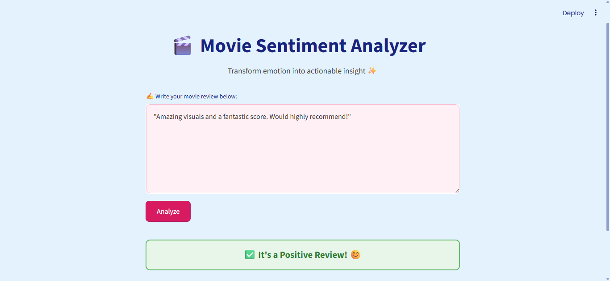
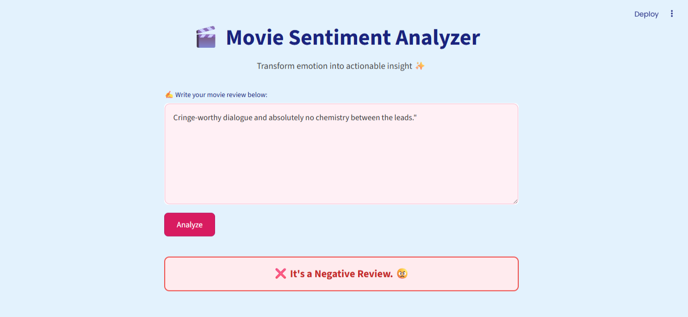

# 🎬 Movie Sentiment Analyzer

A sleek, AI-powered web app that classifies movie reviews as **Positive 😊** or **Negative 😠** using a machine learning model trained on real-world IMDB data. Designed with a modern UI, this app is perfect for freelance delivery, product demos, or NLP showcases.

---

## ✨ Demo

> **[Live Demo on Streamlit Cloud](https://sentiment-analyzer-ysseww4ucvkuiywzgmrjsp-parthmendiratta.streamlit.app/)**  

---

## 📸 Preview

### ✅ Positive Review Example


### ❌ Negative Review Example

---

## 🚀 Features

- 🎯 Real-time movie review sentiment prediction  
- 🧠 ML model trained on 50,000 IMDB reviews  
- 💅 Stylish, gradient UI with Google Fonts  
- ⚡ Fast predictions using TF-IDF + Logistic Regression  
- ☁️ Deployabled on Streamlit Cloud 

---

## 🛠️ Tech Stack

| Layer        | Tool                            |
|--------------|----------------------------------|
| Frontend     | Streamlit + HTML/CSS             |
| ML Model     | Scikit-learn (TF-IDF + LogisticRegression) |
| Preprocessing| Regex + pandas            |
| Styling      | Custom CSS + Google Fonts        |
| Deployment   | Streamlit Cloud                  |

---

## 📂 Project Structure

```
sentiment-analyzer/
├── app.py                 # Streamlit frontend
├── sentiment_model.py     # Model training + predict_sentiment()
├── model.pkl              # Trained logistic regression model
├── vectorizer.pkl         # Saved TF-IDF vectorizer
├── IMDB Dataset.csv       # 50k labeled reviews
├── requirements.txt       # Python dependencies
├── .streamlit/
│   └── config.toml        # Force light theme
```

---

## ⚙️ How It Works

1. The user enters a movie review.  
2. The app cleans the text using regex.  
3. Text is vectorized using TF-IDF.  
4. A logistic regression model classifies it as **Positive** or **Negative**.  
5. The result is styled and displayed with emoji feedback.  

---

## 📦 Run Locally

### 1. Clone the repo
```bash
git clone https://github.com/parthmendiratta/sentiment-analyzer.git
cd sentiment-analyzer
```

### 2. Install dependencies
```bash
pip install -r requirements.txt
```

### 3. Run the app
```bash
streamlit run app.py
```

---


## 🎯 Use Cases

- Freelance portfolio piece  
- Product review analysis  
- Sentiment dashboard prototype  
- NLP teaching demo  

---

## 🧠 Model Performance

| Metric     | Score   |
|------------|---------|
| Accuracy   | ~89.9%  |
| Precision  | ~90%    |
| Recall     | ~90%    |
| F1-Score   | ~90%    |

Trained on a perfectly balanced IMDB review dataset (25k positive, 25k negative).

---

## 🧑‍💻 Author

**Parth Mendiratta**  
 
> 💼 [LinkedIn](https://www.linkedin.com/in/parth-mendiratta-66aa48305?lipi=urn%3Ali%3Apage%3Ad_flagship3_profile_view_base_contact_details%3BJiswDvyNSLmtIc%2F5yMtf6Q%3D%3D)  
> 💻 [GitHub](https://github.com/parthmendiratta)

---

## 📜 License

This project is open source and free to use for educational and showcase purposes.
